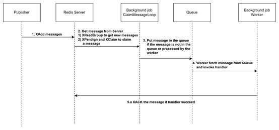

# Redis Pubsub provider

Redis pubsub provider is designed to ensure reliable communication between symphony publishers and subscribers. When a publisher sends a message to the provider, it is stored in the Redis server. A background job periodically polls the Redis server for messages and distributes them to subscribers. The handler, registered at the time of subscriber creation, is automatically invoked. If the handler successfully processes the message, it is acknowledged by the client. Otherwise, the message remains in the server, awaiting the next polling cycle.

# Workflow

# Exact-once successful delivery
There is an important criteria in the redis pubsub design which is called "Exact-once successful delivery". This ensures that each message is delivered and processed only once successfully, without duplication or loss.
Assume there are three replicas, each with a background job polling for pending messages. Each replica frequently attempts to claim messages it owns, resetting the idle time and preventing other replicas from claiming them. Additionally, each replica occasionally tries to claim messages owned by others at a lower frequency. This approach ensures that messages can still be claimed if the original owning replica fails, while also preventing simultaneous claims by multiple replicas.
Within a single replica, we use an in-memory map called ClaimedMessage to ensure that a message’s handler is not invoked more than once simultaneously. If a message has already been processed or is awaiting processing, the polling background job will simply reset the message’s idle time without requeuing it.
